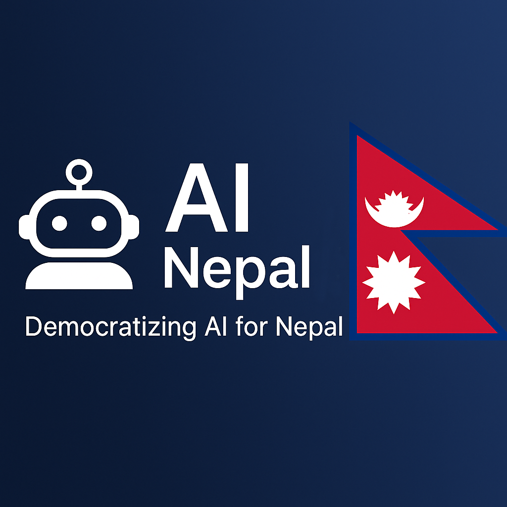

# 🤖 AINepal – Building Nepal's AI Future

Welcome to **AINepalF**, an open-source initiative dedicated to making Artificial Intelligence and Machine Learning **accessible**, **educational**, and **impactful** for everyone in Nepal.

<p align="center">
  <a href="https://youtube.com/@ainepalofficial"></a>
  <a href="https://github.com/pradipchaudhary/ainepalf"></a>
  <a href="https://github.com/pradipchaudhary/ainepalf/issues"></a>
  <a href="LICENSE"></a>
</p>





---

## 🌟 Our Mission

At **AINepalF**, we believe that **AI should be for everyone** — not just big tech companies or researchers in Silicon Valley.

Our vision is to **democratize AI in Nepal** by:

- 🌐 Developing open-source AI tools tailored for the **Nepali language and context**.
- 📚 Providing educational resources in **Nepali**, covering Python, ML, and AI.
- 👥 Creating a **supportive community** of learners, creators, and collaborators.

---

## 🚀 What We Offer

### 🔧 AI Tools for Nepal
- Nepali **OCR (Optical Character Recognition)**.
- **Speech-to-Text** models for local languages.
- Nepali **Chatbots**, **NLU**, and **NLP** tools.
- Tools to help build **inclusive digital ecosystems**.

### 🎓 Learn on YouTube
We publish **easy-to-understand tutorials** in Nepali:

- 🔍 Introduction to AI & ML in Nepali.
- 🐍 Python for Beginners.
- 🗣️ Nepali Speech Recognition.
- 🧾 OCR for Devanagari Script.
- 🤖 Building Chatbots in Nepali.

📺 **Watch & Subscribe** → [youtube.com/@ainepalofficial](https://youtube.com/@ainepalofficial)

---

## 🌍 Use Cases

- Natural Language Processing (NLP) for Nepali.
- Chatbots and virtual assistants for Nepali users.
- AI-driven business automation and local services.
- AI in education, healthcare, and agriculture sectors.

---

## 🛠 Technologies Used

- Python
- TensorFlow / PyTorch
- Hugging Face Transformers
- OpenAI GPT Models
- LangChain (planned integration)

---


## 🌟 Support & Community

- ⭐ Star this repo to support the project.
- 🗨️ Join discussions and suggest ideas or request features.
- 🤝 Contribute AI models, datasets, or tools.
- 🔗 Share the project to grow the AI Nepal community.

---

## 📄 License

This project is licensed under the **MIT License** – feel free to use, remix, and build on top of it.  
See [`LICENSE`](./LICENSE) for details.

---

## 📬 Connect With Us

Stay updated, share ideas, and join our mission:

- 📺 YouTube: [AINepal Channel](https://youtube.com/@ainepalofficial)
- 📧 Email: [hire.pradipc@gmail.com](mailto:hire.pradipc@gmail.com)
- 🌐 Website: *Coming Soon*
- 💬 Community: *Discord/Facebook – launching soon*

---

## 🙏 Thank You!

Whether you're a **student**, **developer**, or **enthusiast** — you're part of the **AI movement in Nepal**.  
Let's build something meaningful together.

**धन्यवाद | Thank you | AI for All 🇳🇵**

---

## 👤 Created by

**Pradip Chaudhary**  
[GitHub](https://github.com/pradipchaudhary) • [LinkedIn](https://linkedin.com/in/pradipchaudhary) • [Twitter](https://twitter.com/pradipchau)
```
